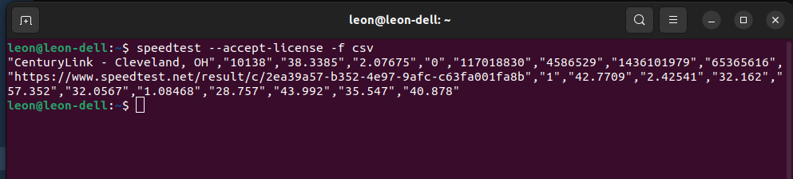
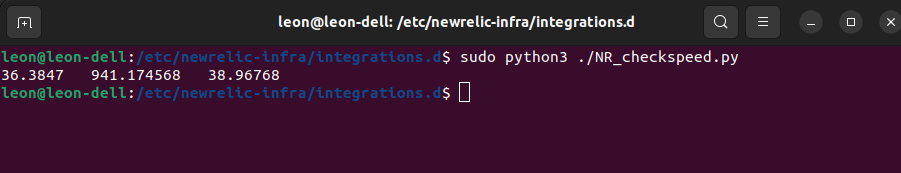
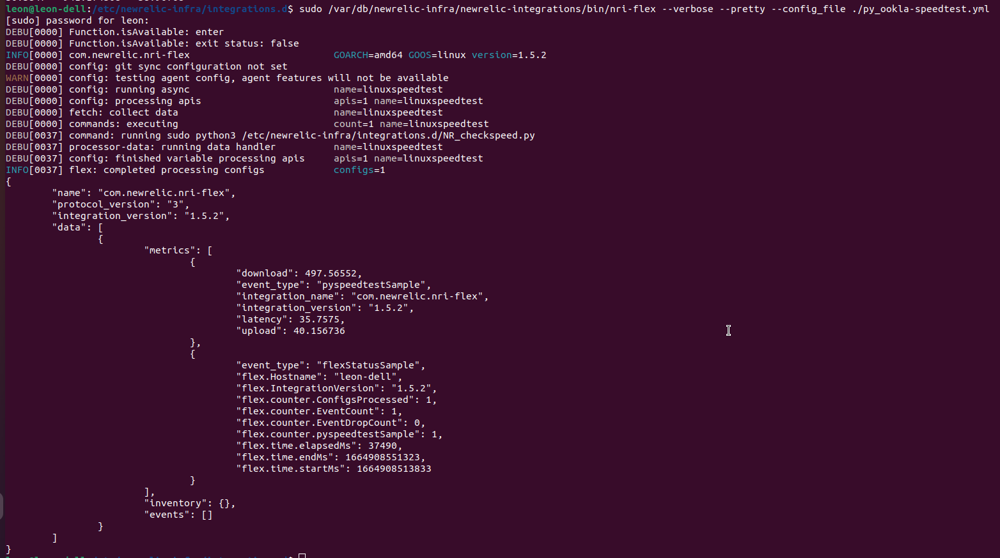
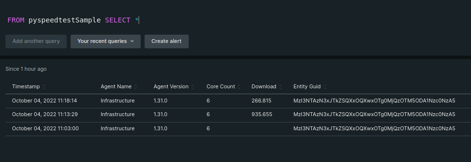
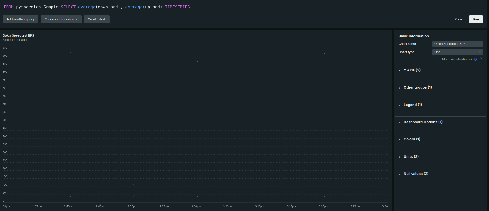
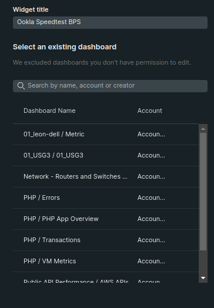
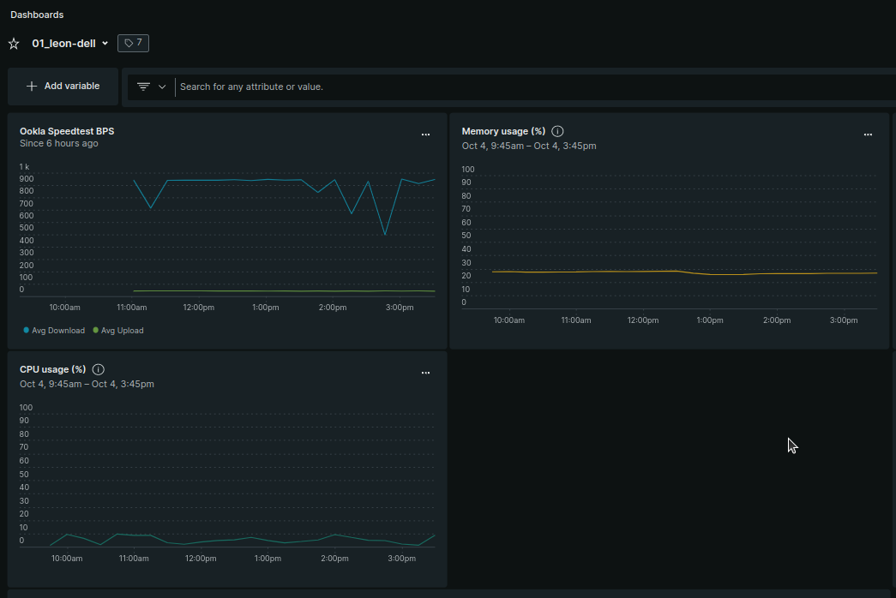

In my [last post on New Relic Flex](!!LINK!!) I talked about times when the pre-made New Relic agents and quickstarts are missing a critical metric or value. In those cases, Flex is a handy option to close the gap and get you the data you need.

In [that post](!!LINK!!), I used a simple example - taking the output of a standard command (I used `df` for Linux systems and `netstat` for Windows), pushed it to New Relic, and displayed it as a chart on a dashbord.

In this post I want to take that concept a step further: There are situations where those simple scenarios aren't sufficient. This can be due to:
 * the output of isn't in the proper format
 * the data needed is the result of multiple commands
 * there is no existing command

In those cases, IT practitioners often turn to scripting to reformat, combine, or create the data needed. And so the question is how to get the result of such scripts into New Relic. 

The good news is this isn't significantly different from running built-in commands. In this post, I simply want to cover a few of the nuances to help you avoid common pitfalls as you get started.

#What problem are we solving?

A common question we all have - whether in a corporate setting or at home - is "am I getting the internet speed I'm paying for?". To answer this, we're going to first install Ookla's [Speedtest.net](https://www.speedtest.net/) command line utility using the instructions found [here](https://www.speedtest.net/apps/cli). 

Once it's installed, test it out to ensure it works the way we'll need it, by going to your command line prompt/terminal and typing:

    speedtest --accept-license -f csv

You should see output like this:

There are some problems with that output. 

 * First, we don't need ALL that information
 * Second, the main data we want (upload/download speed) is in a raw format. To get the bits per second (bps) value we expect, we need to divide it by 125000

So, through the magic of a script (which I'll share later in this post) I'm going to reduce the output to 3 values: latency, download speed (in bps), and upload speed (also in bps).

Like I said, I'll share my script at the end of this blog. But the focus of this post is how to get Flex to pick up those values, so for the moment I'll ask you to simply accept that I have a python script named "NR_checkspeed.py" that outputs the following information:

#What's the YAML file look like?
If you've been following along from the first post, this file doesn't look terribly different. I want to draw your eye to a couple of specific 

	integrations:
	  - name: nri-flex
	    timeout: 5m
	    interval: 10m
	    config:
	      name: linuxspeedtest
	      apis:
	        - name: pyspeedtest
	          commands:
	            - run: sudo python3 /etc/newrelic-infra/integrations.d/NR_checkspeed.py
	              split: horizontal
	              split_by: \s+
	              set_header: [latency,download,upload]
	              timeout: 300000

The first point is purely for the production implementation: you do NOT want to be checking your internet speed every 10 minutes. So ratchet the `interval` line to:

	interval: 1h

Meanwhile, if you've run speedtest from the command line, you know it's not exactly snappy. Flex expects a default execution under 30 seconds, so that's not going to work. Setting the `timeout` inside the `commands` block will fix it:

	timeout: 300000

That's 5 minutes converted to miliseconds. 

Now we move on to the way the output is handled:

    split: horizontal

This tells Flex to take multiple values that appear in a line and break them up into separate data points.

    split_by: \s+

Furthermore, the symbol Flex uses to determine where one value ends and another begins is multiple spaces. This uses standard regular expression syntax.

    set_header: [latency,download,upload]

Finally, this line sets the headers, which we'll use to set up our NRQL query in [one.newrelic.com](https://one.newrelic.com). 

For more about these settings, along with ALL of the Flex configuration options, check out [the official documentation, which you'll find here.](https://docs.newrelic.com/docs/infrastructure/host-integrations/infrastructure-integrations-sdk/specifications/host-integrations-standard-configuration-format/) 

#'Troubleshooting' and other swear words
In my first post I didn't dig into the process of checking if things are working, or - if not - why not, but we should take a moment now. 

Without the following techniques, the only way you'll know if your flex integration works is to set up a simple NRQL query and keep checking the output for error messages. But there are better options.

##Run Flex manually

You can run the New Relic flex utility on the commandline and see the output immediately. The utility is found at: `/var/db/newrelic-infra/newrelic-integrations/bin/nri-flex`. While there are a bunch of commandline options, the ones you want for troubleshooting are `--verbose` and `pretty`

SO... presuming our sample yaml file above is named py_ookla-speedtest.yml, our command would be:

	sudo /var/db/newrelic-infra/newrelic-integrations/bin/nri-flex --verbose --pretty --config_file ./py_ookla-speedtest.yml

The output of that command would look something like this:

##Logging
You can also set up the logging level of the nri-flex utility itself. Edit the file `/etc/newrelic-infra.yml` and include the following items:

	log:
	  file: '/var/log/newrelic-infra/newrelic-infra.log'
	  level: debug
	  forward: true
	  stdout: false

For more information on logging options, check out [the documentation on infrastructure agent options](https://docs.newrelic.com/docs/infrastructure/install-infrastructure-agent/configuration/infrastructure-agent-configuration-settings/).

#The Necessary NRQL
The section on "Troubleshooting" notwithstanding, if everything works, you're ready to start showing the data in New Relic. Head over to [your New Relic portal](https://one.newrelic.com/), open up a NRQL window, and type the following query:

	FROM pyspeedtestSample SELECT *

This will show you IF you're collecting data at all, and if so, are you getting an error or data. Once again, I'm going to presume you've got data coming in, as you'll see from output that looks something like this:

As you can see from the screenshot, we've got download metrics coming in. Scroll to the right and you'll also find columns for "Upload" and "Latency". The NRQL you need to show the latency; and on a separate chart the upload/download speeds, would be:

	FROM pyspeedtestSample SELECT average(latency) TIMESERIES

and 

	FROM pyspeedtestSample SELECT average(download), average(upload) TIMESERIES 

Once your query is working, over on the right column you give it a name, select the graph type, and assign it to one of your dashboards:

#The script behind the scenes
This section isn't strictly necessary, as the script is the least important part of this exercise. However you get the speedtest utility to output those 3 numbers (latency, download bps, and upload bps) is fine. But I understand that some folks may not feel confident in their scripting ability; or maybe you tried it and felt it didn't work correctly, and want to compare to my version. Whatever the reason, here's the script I based this blog on.

	import os
	import subprocess
	#========================================
	#Define variables
	speedlist = speedrun = ""
	latency = download = upload = ""
	batch = response = ""
	#========================================
	#Function Junction
	def fixnum(x):
	  x = x.replace('"', '')
	  x = float(x)
	  return x 
	#========================================
	speedrun = os.popen("speedtest --accept-license -f csv").read()
	speedlist = speedrun.split(",")
	latency = fixnum(speedlist[3])
	download = fixnum(speedlist[6]) / 125000
	upload = fixnum(speedlist[7]) / 125000
	print(latency, " ", download, " ", upload)

To break this down a bit:

	import os
	import subprocess

This includes two modules we need later - to run external commands and get the results back into the program

	def fixnum(x):
	  x = x.replace('"', '')
	  x = float(x)
	  return x 

This subroutine removes the quotes around the CVS output.

	speedrun = os.popen("speedtest --accept-license -f csv").read()

Run the speedtest command and grab the results.

	speedlist = speedrun.split(",")

Split the results into multiple values.

	latency = fixnum(speedlist[3])
	download = fixnum(speedlist[6]) / 125000
	upload = fixnum(speedlist[7]) / 125000

Take each of the component values and assign them names. Also divide the download and upload numbers by 125,000 to get an accurate "bits per second" value.

	print(latency, " ", download, " ", upload)

Echo the results, to be picked up by Flex.
